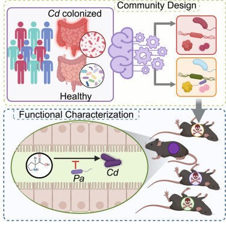

```{r setup, include=FALSE}
knitr::opts_chunk$set(echo = TRUE, cache = FALSE, message=F, warning=F)
```


# Background

The goal of this session is to give you a quick intro into how to explore and visualize 'omics data. We will be building off down-sampled data collected as part of [Tian et al. Cell Host & Microbe 2025](https://www.cell.com/cell-host-microbe/fulltext/S1931-3128(25)00055-1). In short, this data is derived from microbiome sequencing data of healthy individuals and those who are colonized with <i>C. difficile</i>.




***

# Preparing For Class

Before our session, please complete the sections below. The goal is for you to have downloaded all of the data and software ahead of time so we can focus on concepts and data interpretation rather than troubleshooting. That being said... installing software is often the most difficult part of bioinformatics, so please email `jordan.bisanz@psu.edu` if you run into difficulties. You will need access to a mac/windows/Linux machine with at least ~100 MB of free storage. If you can't access a computer, please let me know ahead of time and I can make an arrangement for you to remotely access a R studio session via your web browser.

## Installing R and R Studio

We will be making use of the R programming language which is commonly used across many fields for statistical analysis. To begin, please install and/or update to version of R (4.5.2 by downloading from the following [link](https://cran.rstudio.com/). R is commonly accessed through an easy-to-use interface called R studio. Please downloaded [here](https://posit.co/download/rstudio-desktop/). R and many of the packages you would use for data analysis are updated on a regular basis, **please ensure you have the latest version of R.** 

If you are not familiar with R, it is an extremely useful tool for analyzing and visualizing data. If you are not familiar with it, please watch these videos before our class:

*  [Introduction to R Programming with Data Camp](https://www.youtube.com/watch?v=HkNFn6eosaU)
*  [Getting started with R and RStudio](https://www.youtube.com/watch?v=lVKMsaWju8w&t=3s)
*  If you are interested in learning more R, I recommend [this book](https://www.amazon.com/Data-Science-Transform-Visualize-Model/dp/1491910399/ref=sr_1_9?dchild=1&keywords=tidyverse&qid=1620329413&s=books&sr=1-9).


To ensure you have successfully installed the software, please open R studio and type the following code into your console:

```{r eval=F}
R.Version()$version.string
```

The expected output that should be reported is: `R version 4.5.2 (2025-10-31)`.

## Installing Required Packages

Generally speaking, most packages for bioinformatics exist in 3 places: CRAN, Bioconductor, and Github. CRAN is the main R repository from which packages can be installed using `install.packages()`. Bioconductor is a repository specializing in bioinformatics. Bioconductor packages are installed via its own package (available from CRAN) called BiocManager which has a function called `BiocManager::install()`. Finally, the newest versions of packages or in-development packages are often found on github which can be installed using a package called devtools which offers `devtools::install_github()`. To install the required packages, copy and past the code below line by line into your R session. If asked to compile type `yes` and if asked to update packages types `no`.

```{r, eval=F}
install.packages("tidyverse") # A group of related packages to facilitate a wide variety of useful tasks including plotting

install.packages("devtools") # A multi-purpose tool for developing and installing packages
install.packages("BiocManager") # The package manager for Bioconductor

install.packages("vegan") # A commonly used ecology package offering diversity calculations and statistical tests
install.packages("ape") # A package for phylogenetic analysis offering several useful functions for microbial ecology

devtools::install_github("jbisanz/qiime2R") # A multi-purpose microbiome import/processing package written by yours truly. This will also isntall a number of other pre-requisit packages.

install.packages("caret")
install.packages("randomForest")
```

After you have installed all of the above packages, it is a good idea to try loading them one by one as below. If a package fails to load, read the error message and then try to reinstall. If still having issues please run past your favorite LLM for assistance. Please contact me if there are issues which you can't resolve.

```{r message=F, warning=F}
library(tidyverse)
library(readxl) #part of the tidyverse for reading excel files
library(ape)
library(vegan)
library(qiime2R)
library(caret)
library(randomForest)
```

## Downloading Data

```{r echo=F, eval=F}
#creating subset data by giving only genus summarized data and filtering for a minimum frequency of occurence
#run on server
library(tidyverse)
library(qiime2R)
library(readxl)
setwd("/home/sbt5355/CD_Metaanalysis/")
asv_table<-readRDS("combined_outputs/ASV_Table_Filtered.RDS")
asv_tax<-readRDS("combined_outputs/ASV_taxonomy.RDS")
genus<-summarize_taxa(asv_table, asv_tax %>% column_to_rownames("FeatureID"))$Genus
genus_filt<-genus %>% filter_features(5,5)


metadata<-read_excel("CD_metaanalysis_current_manuscript/PerSampleData_status.xlsx") %>% 
  mutate(SampleID=if_else(is.na(BioSample) | BioSample == "NA", OriginalSampleID, BioSample)) %>%
  dplyr::select(SampleID, StudyID, Age_years=Age, Sex_MF=Sex, Cdifficile)
gplots::venn(list(Genus=colnames(genus), metadata=metadata$SampleID))

metadata<-metadata %>% filter(SampleID %in% colnames(genus))
genus<-genus[,metadata$SampleID] %>% filter_features(1,1)

dir.create("~/sandbox/BMMB521_data")

write_tsv(genus %>% rownames_to_column("FeatureID"), "~/sandbox/BMMB521_data/Genus_Abundances.tsv")
write_tsv(metadata, "~/sandbox/BMMB521_data/Metadata.tsv")

###############
file.copy("/Volumes/Bisanz_Home/jpb6325/sandbox/BMMB521_data/", ".", recursive=TRUE)

##############
#Generate student problem 1 - EOSC
#got data from the EOSC github repo
metadata<-read_excel("~/bisanzlab/github/BMMB521_SP26/assigned_data/EsophagealCancer/EOSC_metadata_2026Feb11.xlsx") %>% filter(SampleType=="Saliva") %>% dplyr::select(SampleID, Group, Age_Years=Age, Sex_MF=Sex, AlcoholConsumption_YN=`Alcohol Drink`) %>% mutate(Group=if_else(Group=="Diseased", "Cancer","Control"))
write_tsv(metadata, "~/bisanzlab/github/BMMB521_SP26/assigned_data/EsophagealCancer/metadata.tsv")


features<-summarize_taxa(readRDS("~/bisanzlab/github/BMMB521_SP26/assigned_data/EsophagealCancer/asv_table.RDS")[,metadata$SampleID], readRDS("~/bisanzlab/github/BMMB521_SP26/assigned_data/EsophagealCancer/asv_taxonomy.RDS") %>% column_to_rownames("ASV"))$Genus %>% filter_features(3,3)
write_tsv(features %>% rownames_to_column("FeatureID"), "~/bisanzlab/github/BMMB521_SP26/assigned_data/EsophagealCancer/genus_abundances.tsv")

# Generate student problem 3 - High fat


# Generate student problem 2 - 
```


We will start by creating a new directory for our project using the `dir.create()` function. I am going to place this on my desktop, but you might want to pick somewhere else depending on your computer.

```{r, eval=F}
dir.create("~/Desktop/BMMB521_tutorial") #Note: windows users would use dir.create("C:\\Users\\YourUserName\\Desktop\\BMMB521_tutorial")
```

Then we can specifically set our working directory to be inside this older as below:

```{r, eval=F}
setwd("~/Desktop/BMMB521_tutorial") #Note: windows users would use setwd("C:\\Users\\YourUserName\\Desktop\\BMMB521_tutorial")
```

### Feature Abundances

In this case we will be using data which has already been processed. We will download a table of genus-summarized microbial abundances where each column is a sample, and each row is a genus. The values represent the number of reads (counts) assigned to each genus on a per-sample basis.

Let us download it as below:

```{r, eval=F}
dir.create("data")
download.file("https://github.com/BisanzLab/BMMB521_SP26/raw/refs/heads/main/data/Genus_Abundances.tsv","data/Genus_Abundances.tsv")
```

### Metadata

Having the data is great, but unless we know what it is, it is pretty useless. This is called metadata, and a spreadsheet (in tab separated format) is available to download as below. Note that you could just as easily use excel spreadsheets; however, there are some special considerations for reading/writing excel files and they love to auto-convert text to dates which can cause issues.

```{r, eval=F}
download.file("https://github.com/BisanzLab/BMMB521_SP26/raw/refs/heads/main/data/Metadata.tsv","data/Metadata.tsv")
```

***

After all of this, you should find a folder on your desktop called `BMMB521_tutorial`. Within this folder, you should find a sub folder called data containing two files: your Metadata.tsv file, and the Genus_Abundances.tsv file. With these and the packages installed, you are ready to begin!

<style>
div.blue { background-color:#e6f0ff; border-radius: 5px; padding: 20px;}
</style>
<div class = "blue">
Stop here before class!
</div>

```{r echo=F}
knitr::knit_exit()
```

***

# Setting up your environment

Much like you might set up your bench before starting an experiment, or do your mise en place before cooking a meal, it pays to take some time to set up your digital work space before starting an analysis. You should always keep a record of all the tools and commands you used to perform your analysis. This is essential to reproducibility! At a minimum, you can create a new R script (File > New File > R markdown). R markdown documents combine raw code, with free-text sections and function like an electronic note book for your analysis. This is great to document your analysis and can be shared later with collaborators/reviewers/etc... guess what this document is? Visit [here](https://github.com/BisanzLab/BMMB521_SP26/blob/main/index.Rmd) to see the markdown document for this class!

As a first pass we can load our libraries that we will need as below:

```{r message=F, warning=F}
library(tidyverse)
library(readxl) #part of the tidyverse for reading excel files
library(ape)
library(vegan)
library(qiime2R)
library(caret)
```

Next we can make sure we have set our working directory. This ensures we will be able to properly find our files. This was set up before class and is likely on your desktop called `~/Desktop/BMMB521_tutorial`. We can explicitly set our working directory with the `setwd()` function.

```{r eval=F}
setwd("~/Desktop/BMMB521_tutorial") # setwd("C:\\Users\\YourUserName\\Desktop\\BMMB521_tutorial") for windows users
```

Next we might want to set up some directories for our outputs as below:

```{r}
dir.create("figures")
```

Finally, it is always helpful to keep a record of your work environment. This can easily be accomplished with `SessionInfo()` as below. Having a list of all of the packages you used and the versions can be very helpful later when writing a manuscript!

```{r}
sessionInfo()
```

Before going forward, we will read in our metadata table with the help of the `read_tsv()` function. At any point you can click on your data in the top right corner of R studio and it will open in a tab for you to look at!

```{r}
metadata<-read_tsv("data/metadata.tsv")
```

You could visualize your table to inspect it using either of the methods below:

```{r eval=F}
View(metadata)
```

```{r}
interactive_table(metadata)
```

We can then explore it as below:

```{r}
metadata %>% count(StudyID, Cdifficile) %>% knitr::kable()
```

**Question: what do you think about these sample sizes? Do you think this is a well powered analysis?**

Now we can view our actual organism abundances. These are genus-summarized abundances, but the table is too large to visualize all at once so we will only look at the upper corner of the file. We are also going to play with a quirk of R/tidyverse and move the first column of the file containing the names of the genera to be "row names".

```{r}
features<-read_tsv("data/Genus_Abundances.tsv")
corner(features)
features[1:5,1:5]#alternate way to view first 5 rows and 5 columns in R
features<-features %>% column_to_rownames("FeatureID")
```

**Question: Are you surprised to see Archaea in this dataset?**

**Question: How might you find the most abundant genus in this dataset?**

```{r, eval=F, echo=F}
features %>% make_percent() %>% rowMeans() %>% sort(decreasing=TRUE) %>% head()
```

***

# Exploratory Data Analysis

Exploratory data analysis (EDA) is just what it sounds like. It is the initial process of "exploring" the data to understand what it looks like, what patterns may be present, and any potential issues in the data before doing formal statistical approaches. The main goal is to generate summary figures and generate hypotheses before going into formal hypothesis testing.

## Barplots

Stacked are excellent for showing compositions, but capture only the most abundant features. We could for example use the helper function `qiime2R::taxa_barplot()` to visualize our 10 most abundant features.

```{r}
taxa_barplot(features)
ggsave("figures/barplot.pdf", height=7.5, width=10) #save a pdf copy in the figures folder, make it 7.5 inches tall by 10 inches wide
```

This helps, but we probably want it split by one or more variables. The function has a built in way to do this... maybe you should read its help page. To view the help for a function just type `?taxa_barplot` in the console.

**Challenge: Recreate the plot below.**

```{r echo=F}
taxa_barplot(features, metadata, "Cdifficile")
```

**Question: what patterns do you see?**

## Heatmaps

There are many packages which can produce a heat map. We will use the `qiime2R::taxa_heatmap()` function to visualize our 50 most abundant features:

```{r}
taxa_heatmap(features, metadata, "Cdifficile")
ggsave("figures/heatmap.pdf", height=7.5, width=10) #save a pdf copy in the figures folder, make it 7.5 inches tall by 10 inches wide

```

**Question: what patterns do you see? Are these the same patterns you saw in the barplot?**

**Challenge: use your favorite LLM to make a heat map from this data.**


***

# Diversity Analysis

Diversity analysis could be categorized as a subtype of exploratory data analysis which is somewhat specific to microbiome and metabolome data. There are two subtypes we will examine today: alpha diversity which describes the richness and evenness of the sample, and beta diversity which examines compositional similarity. Beta diversity is often used for dimensional reduction approaches.


## Alpha diversity

One of the most obvious ways to describe a community is in terms of its diversity. While we probably all intuitively understand the concept, how might we actually define it quantitatively?

Consider the following two samples, which would you say is more diverse?

```{r, echo=F}
tibble(Organism=c("E. coli","L. rhamnosus","S. aureus"), SampleA=c(99,1,1), SampleB=c(50,50,0)) %>% knitr::kable()
```

Perhaps the simplest metric you could think of is the number of species (or in our case genera) present in an ecosystem which is commonly applied. If we apply this metric to our fake data above, we would conclude that SampleA is more diverse (it has 3 organisms present vs 2). Others are a little bit more complex such as Shannon Diversity which use both the number of species present and their evenness. In the case of the fake data above, Sample B is more diverse (0.69 vs 0.11). Today we will use the number of observed genera and the Shannon diversity on our actual data. *Note: in the vast majority of cases these values will be highly correlated.*

Before going forward, we also need to consider the effect of sampling depth and account for it by subsampling/rarefying the data. This is a way to normalize for sequencing depth <i>in silico</i> which is appropriate here, but [may not always be advisable](http://journals.plos.org/ploscompbiol/article?id=10.1371/journal.pcbi.1003531). 

**Question: how even is our sequencing depth across samples?**

**Question: do you think it would be safe to proceed without controlling for sequencing depth?**

We will use two functions from `vegan` to calculate our alpha diversity metrics: `specnumber()` and `diversity()`. In both cases we will down sample the data using `subsample_table()`.

```{r}
set.seed(182) #required for some installations to ensure that subsampling can be reproducible
features_subsampled<-subsample_table(features)

shannon_diversity<-diversity(features_subsampled, "shannon", MARGIN=2) #why would I put MARGIN=2 here? Try without it and see what happens.
obs_genera<-specnumber(features_subsampled, MARGIN=2)
```

**Challenge: Look at the metrics and their distribution. What distributions do they seem to follow?**

Now let us plot these. This will be our first introduction to building a plot using ggplot2 which is a very powerful graphing package included in the tidyverse. See the cheat sheet [here](https://posit.co/wp-content/uploads/2022/10/data-visualization-1.pdf). To build the plot we will do a few sequential tasks:

<Br>Step 1- Join the alpha diversity metrics to the metadata using `join` commands.
<Br>Step 2- Feed data to ggplot
<Br>Step 3- Pick the type of plot we are interested in. Refer to the cheat sheet above
<Br>Step 4- Make it look nice and play around with visualizations.

```{r}
# Step 1
shannon_diversity<-
  data.frame(Shannon_diversity=shannon_diversity) %>%
  rownames_to_column("SampleID") %>%
  left_join(metadata)

#Step 2
shannon_diversity %>%
  ggplot(aes(x=Cdifficile, y=Shannon_diversity))

#Step 3
shannon_diversity %>%
  ggplot(aes(x=Cdifficile, y=Shannon_diversity)) +
  geom_boxplot()

#Step 4
shannon_diversity %>%
  ggplot(aes(x=Cdifficile, y=Shannon_diversity, fill=Cdifficile)) +
  geom_boxplot() +
  theme_q2r() +
  scale_fill_manual(values=c("cornflowerblue","indianred")) +
  theme(legend.position = "none")
ggsave("figures/shannon.pdf", height=3, width=2)

```

**Question: what do you conclude from this plot?**

**Challenge: is there an alternate visualization of this plot you think could be effective?**

**Question: is there a second variable that we should consider? How might you visualize it?**

Now we might actually want to do some statistics. In the simplest case we might consider just a simple paired t-test as below. In a more complex example we may want to control for the impact of study.

```{r}
t.test(Shannon_diversity~Cdifficile, data=shannon_diversity)
```

We can see that the difference is very significant (P<2.2e-16). But let's look at controlling for the study using a mixed effect model. This will require a package called lmer/lmerTest which was not included in the downloads for class but for which you could install for interest.

```{r}
lmerTest::lmer(Shannon_diversity~Cdifficile+(1|StudyID), data=shannon_diversity) %>% summary()
```

**Question: did controlling for inter-study variation impact your conclusion?**

**Challenge: repeat the analysis for the observed genus counts.**


## Beta diversity (dimensional reduction)

Beta diversity refers to a way of measuring similarity between samples. These are often called distances or dissimilarities. Conceptually it is easy to measure the distance between two physical points, but how do we measure the distance between two compositions? There is an entire universe of metrics used for this purpose, but today we will use a newer metric called Aitchison distance, also called CLR Euclidean. This metric comes from the field of compositional data analysis (CoDA) and deals with a number of shortcomings of more traditional metrics were developed for macro-ecology. Read more [here](https://www.ncbi.nlm.nih.gov/pmc/articles/PMC5695134/).


```{r}
clr_euc<-features %>% make_clr() %>% t() %>% vegdist(method="euclidean")
```

Now we can look at our distances:

```{r}
as.matrix(clr_euc) %>% corner()
```

We have calculated our distances; however, now we need a human-readable way to interpret them. We need a method for reducing the number of dimensions to something that can be plotted in 2 or 3 dimensions. There are a number of methods, of which you may be familiar with including PCA, PCoA, tSNE, NMDS, etc. Today we will use PCoA which is fairly versatile and can work with a number of microbiome-relevant distance metrics.

```{r}
pc<-pcoa(clr_euc)
```

We can now visualize the plot as below. As before we will build up a series of steps wherein we will extract the X/Y coordinates, join them to the metadata, and then plot using ggplot.

```{r}
pc$vectors %>%
  as.data.frame() %>%
  rownames_to_column("SampleID") %>%
  left_join(metadata) %>%
  ggplot(aes(x=Axis.1, y=Axis.2, color=Cdifficile)) +
  geom_point()+
  theme_q2r() +
  scale_color_manual(values=c("cornflowerblue","indianred")) +
  xlab(paste("PC1:",round(pc$values$Relative_eig[1]*100,2),"%")) +
  ylab(paste("PC2:",round(pc$values$Relative_eig[2]*100,2),"%"))

ggsave("figures/pcoa.pdf", height=2, width=3)  
```

**Question: What trend do you see in this data?**

**Challenge: How might you visualize the inter-study variation?**

We can also do a statistical test for support using Adonis/PERMANOVA which is conceptually similar to an ANOVA but using distances where significance is determined by permutation of the sample labels (hence PERM...ANOVA).

```{r}
adonis2(clr_euc~Cdifficile, data=metadata, permutations = 999, by="terms")
```

**Challenge: We should probably account for study design, how would we do it? See example output below.**

```{r echo=F}
adonis2(clr_euc~Cdifficile+StudyID, data=metadata, strata=metadata$StudyID, permutations = 999, by="terms")
```

***

# Training a predictive model

Rather than do conventional differential abundance testing, since these are quite distinct datasets, we will instead move straight into machine learning to accomplish two goals: (1) train a predictive model of <i>C. difficile</i> colonization, and (2) extract the best predictors of <i>C. difficile</i> infection status.

Remember from our introductory lecture the idea of garbage in = garbage out. We should take some care with our data before we go forward. We will start by normalizing the data and removing features with are either very rare (and could not be meaningful) and/or have very low variation/variance.

```{r}
features_ml<-features %>% filter_features(10,10) %>% make_proportion() # feature must show up in at least 10 samples at least 10 times
feature_variance <- nearZeroVar(t(features_ml), saveMetrics = TRUE) # identify low variance features
features_ml <- features_ml[!feature_variance$nzv,] # now remove them from the table. This works because the output is TRUE/FALSE allowing us to use matrix notation.
```

**Question: how many features are left after removing the rare/low-variance features?**

Now we will do some data wrangling to get the data how caret would like it.
```{r}
training_data<-
  features_ml %>% 
  t() %>% #make the samples rows instead of columns
  as.data.frame() %>% #play games with the many ways R can store tables
  rownames_to_column("SampleID") %>% 
  left_join(metadata %>% select(SampleID, Cdifficile)) %>% # join the category to be predicted to the table
  mutate(Cdifficile=case_when(
                            Cdifficile=="FALSE"~"Negative",
                            Cdifficile=="TRUE"~"Positive"
                            ))  %>% # recode FALSE to Negative and TRUE to Positive for C. difficile detection
  mutate(Cdifficile=factor(Cdifficile, levels=c("Negative","Positive"))) #put the C. difficile status explicitly to be an ordered factor
```

Now we will set up the machine learning approach. We will be using random forest with a 10-fold cross validation strategy. In this approach the data will be cut into 10 equal parts or "folds". The model will be trained on 9 folds and then tested on the 10th. Model training will be repeated 10 times each testing a different left-out fold.

```{r}
training_parameters <- trainControl(
  method = "cv", #cross validation
  number = 10, #10-fold cross validation
  classProbs = TRUE, # will be used for downstream analysis so tell it compute/store these
  summaryFunction = twoClassSummary, # will give performance data relevant for our purposes
  savePredictions = "final" # will keep only the final values rather than for each iteration.
)
```

Now we can actually train our model as below. This may take 1-2 minutes depending on the speed of your computer. There is also a way to greatly speed this up using multiple processors, but it is not natively supported on windows.

```{r}
rf_model <- train(
  Cdifficile ~ . - SampleID, #This says we want to predict Cdifficile using all of the columns "." except Sample ID "-SampleID"
  data = training_data,
  method = "rf", # use random forest
  metric = "ROC", # evaluate models based on the area under the receiver operator curve
  trControl = training_parameters,
  importance = TRUE # return information that lets us evaluate the individual genus importance
)

```

Now we have our model we can look at how it worked. We can start by looking at the Area under the curve for the receiver operator curve (ROC). In general > 0.7 is good, over 0.9 is very high, and ~1.0 is suspicious. We can also look at sensitivity (the proportion of C. diff positive samples correctly identified, also known as true positive rate) and specificity (the proportion of C. diff negative samples correctly identified, also known as true negative rate).

In the output you will notice multiple columns for different `mtry` values. This is a parameter than can be tuned in random forests.

```{r}
rf_model
```

**Question: How do you evaluate this model?**

**Question: How much of a difference did modifying the mtry parameter make?**

**Question: Your results will not be identical to mine. Why? Can you think of a way to help control this?**

To visualize this we could generate a reciever coperate curve and plot it as below. *Note: pROC is a package that was installed along with caret but not explicitely loaded which is why the roc function is called as such.*

```{r}
pROC::roc(rf_model$pred$obs, rf_model$pred$Positive) %>% plot(., print.auc=TRUE)
```

Now we might want to understand which organisms can predict <i>C. difficile</i>. We can do this by examining the importance scores as below.

```{r}
varImp(rf_model)
```

We could also create a plot as below:

```{r}
varImp(rf_model)$importance %>%
  rownames_to_column("Taxon") %>%
  arrange(Positive) %>%
  top_n(30,Positive) %>% # take to top 30 scores
  mutate(Taxon=factor(Taxon, levels=Taxon)) %>% # put these in order by decreasing score
  ggplot(aes(x=Positive, y=Taxon)) +
  geom_point() +
  theme_q2r() +
  xlab("Importance Score")
```

These scores reflect how important somethings is in driving predictions, not the directionality of the association. That can be done in a number of ways. Here we will just fit simple t.tests and extract the difference in means. This will have a biproduct of giving us traditional univariate statistics as well.

```{r}
Ttests<-
training_data %>%
  pivot_longer(!c(SampleID, Cdifficile), names_to = "Taxon", values_to = "Abundance") %>% # reshape the data to the 'long' version
  group_by(Taxon) %>% # do 1 test per taxon
  mutate(Abundance=log2(Abundance+(2/3*min_nonzero(Abundance)))) %>% #take the log2 which is both a safe thing to do to help normalize data, and will make sure what we get back is the log2 fold change
  do(
    t.test(Abundance~Cdifficile, data=.) %>%
      broom::tidy()
  ) %>%
  select(Taxon, log2FoldChange=estimate, Pvalue=p.value)

interactive_table(Ttests)
```

**Question: How well do these match the predictions from the model?**

Now we can add these in to the plot.

```{r}
varImp(rf_model)$importance %>%
  rownames_to_column("Taxon") %>%
  left_join(Ttests %>% mutate(Taxon=paste0("`",Taxon,"`"))) %>% # this fixes an annoying bug in joining
  arrange(Positive) %>%
  top_n(30,Positive) %>% # take to top 30 scores
  mutate(Taxon=factor(Taxon, levels=Taxon)) %>% # put these in order by decreasing score
  ggplot(aes(x=Positive, y=Taxon, color=-log2FoldChange)) + # flipped the sign on log2Fold change as calculated as Negative/Positive rather than Positive/Negative
  geom_point() +
  theme_q2r() +
  xlab("Importance Score") +
  scale_color_gradient2(low="blue", high="darkred")
ggsave("figures/Importance.pdf", height=4, width=7) #save a pdf copy in the figures folder, make it 7.5 inches tall by 10 inches wide
```

**Question: What do you make of the best predictors of <i>C. difficile</i> infection?**

**Question: Do you think there could be any concerns about data leakage? How could you address this?**

**Question: If you were going to design an experiment to follow this up, what would it be?**

